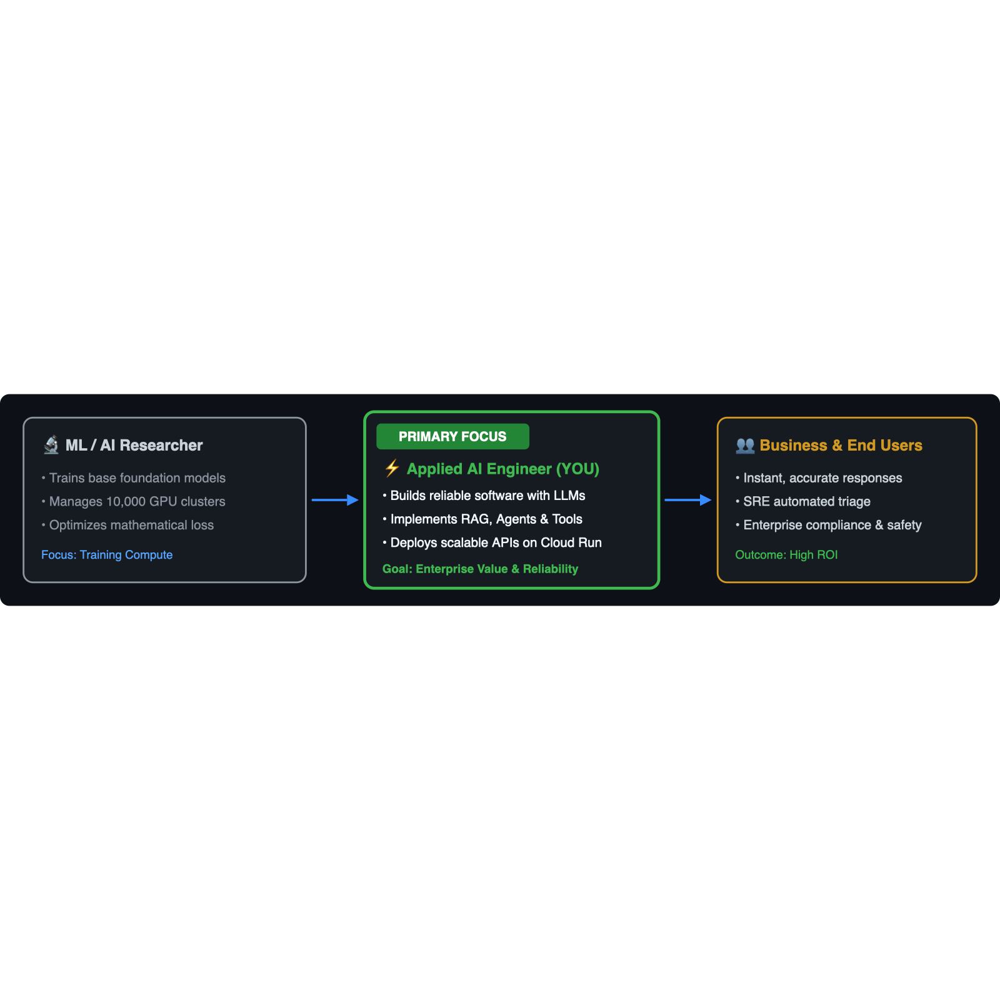
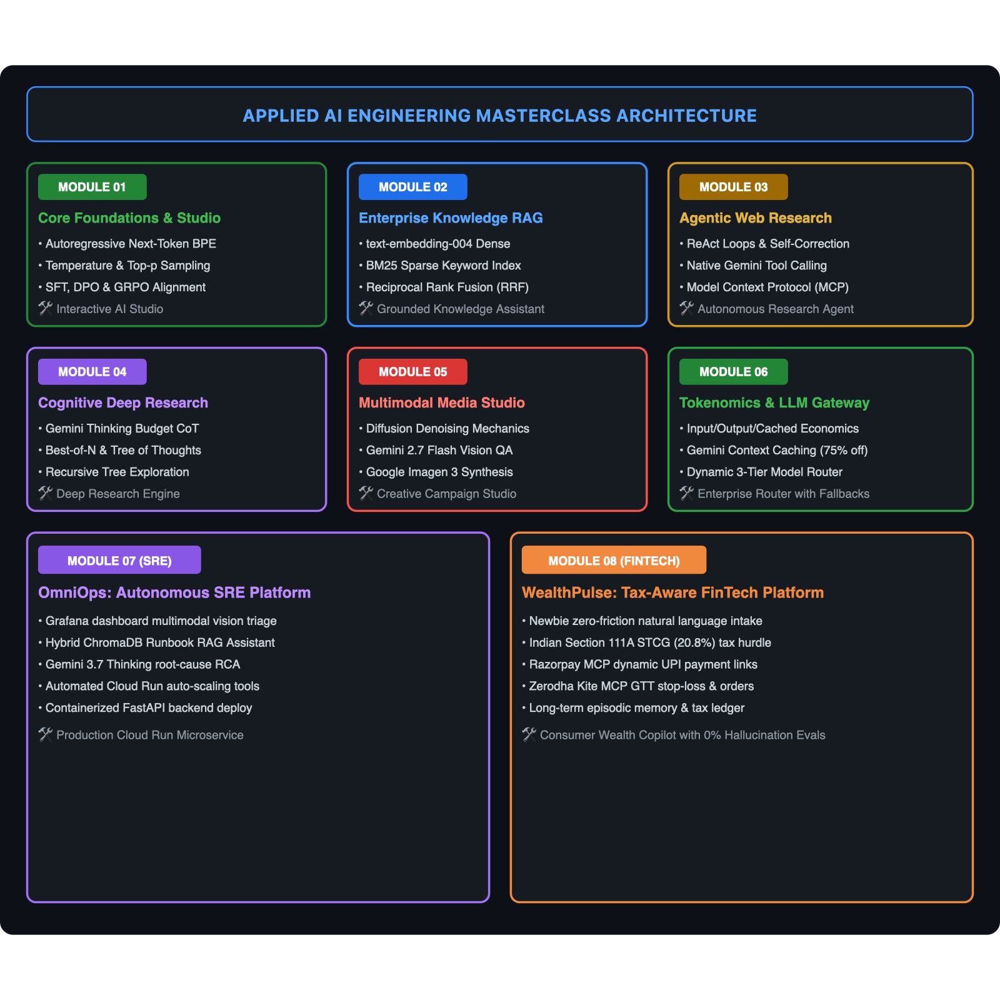

# 🚀 Applied AI Engineering Masterclass: Building Enterprise AI Systems with Google Gemini & Google Cloud

[](https://github.com/googleapis/python-genai)
[](https://ai.google.dev)
[](https://cloud.google.com/run)
[](LICENSE)

> **Welcome, Future Applied AI Engineer!** 👋  
> Whether you are a software engineer stepping into AI, a data scientist wanting to build real-world software, or a complete beginner to Large Language Models (LLMs), this course is designed for you. We take complex research topics—like Transformers, RAG, AI Agents, Reasoning Models, and Diffusion—and break them down into **crystal-clear mental models**, **visual illustrations**, **micro-examples**, and **production-ready code**.

---

## 🌟 What is an "Applied AI Engineer"?

In traditional software, we write deterministic code (`if / else`). In ML Research, scientists train raw foundation models on supercomputers. **Applied AI Engineering** is the practical bridge:

<p align="center">
  
</p>

| Role | Primary Toolset | Focus | Goal |
| :--- | :--- | :--- | :--- |
| **Software Engineer** | Python, TypeScript, APIs, SQL | Deterministic business logic | Fast, bug-free applications |
| **AI Researcher** | PyTorch, CUDA, JAX, Distributed Training | Foundation model architectures | Training loss & academic benchmarks |
| **Applied AI Engineer (This Course)** | `google-genai` SDK, Vector DBs, Cloud Run, Pydantic | Steering, grounding, tool use & orchestrating LLMs | Intelligent, production-ready enterprise systems |

---

## 🏛️ Master Curriculum & System Architecture

<p align="center">
  
</p>

---

## 📁 Repository Index & Notebook Links

| Module | Notebook Link | Core Capabilities Mastered |
| :--- | :--- | :--- |
| **01. Core Foundations** | [`01_LLM_Foundations_Interactive_Playground.ipynb`](./01_LLM_Foundations_Interactive_Playground/01_LLM_Foundations_Interactive_Playground.ipynb) | Next-token prediction, BPE tokenization, Temperature/Top-p sampling dials, Post-training (SFT, DPO, GRPO), and an **interactive streaming AI studio**. |
| **02. Knowledge RAG** | [`02_Enterprise_RAG_Knowledge_Assistant.ipynb`](./02_Enterprise_RAG_Knowledge_Assistant/02_Enterprise_RAG_Knowledge_Assistant.ipynb) | Embeddings (`text-embedding-004`), semantic chunking, dense + sparse BM25 hybrid search via Reciprocal Rank Fusion (RRF), and a **grounded knowledge assistant**. |
| **03. Agentic Workflows** | [`03_Agentic_Workflows_Web_Search_Agent.ipynb`](./03_Agentic_Workflows_Web_Search_Agent/03_Agentic_Workflows_Web_Search_Agent.ipynb) | Agency spectrum, workflow patterns (Routing, Reflection, Parallelism), native Gemini tool calling, Model Context Protocol (MCP), and an **autonomous research agent**. |
| **04. Cognitive Reasoning**| [`04_Reasoning_Models_Deep_Research_Engine.ipynb`](./04_Reasoning_Models_Deep_Research_Engine/04_Reasoning_Models_Deep_Research_Engine.ipynb) | System 1 vs System 2 thinking, Gemini Thinking tokens (`thinking_budget`), test-time compute scaling (Best-of-N, Tree-of-Thoughts), and an **autonomous Deep Research engine**. |
| **05. Multimodal Vision** | [`05_Multimodal_Vision_Media_Synthesis_Agent.ipynb`](./05_Multimodal_Vision_Media_Synthesis_Agent/05_Multimodal_Vision_Media_Synthesis_Agent.ipynb) | Diffusion denoising mechanics, visual inspection with Gemini 3.7 | Gemini 2.5 Flash, photorealistic image synthesis with **Google Imagen 3**, and a **creative campaign studio**. |
| **06. Tokenomics & Gateway** | [`06_Tokenomics_Cost_Optimization_LLM_Gateway.ipynb`](./06_Tokenomics_Cost_Optimization_LLM_Gateway/06_Tokenomics_Cost_Optimization_LLM_Gateway.ipynb) | Input/Output/Cached token economics, Gemini Context Caching (75-90% off), Dynamic 3-Tier Model Router (Flash Lite vs Flash vs Pro), fallback cascades, and live cost telemetry. |
| **07. Capstone SRE** | [`07_Capstone_OmniOps_Autonomous_SRE_Platform.ipynb`](./07_Capstone_OmniOps_Autonomous_SRE_Platform/07_Capstone_OmniOps_Autonomous_SRE_Platform.ipynb) | The Grand Finale: **OmniOps AI**, an autonomous incident triage platform uniting RAG + Vision + Thinking + Tools, packaged as a **FastAPI backend** on **Google Cloud Run**. |

---

## ⚡ Quickstart: Get Running in 3 Minutes

### Step 1: Clone the Repository
```bash
git clone https://github.com/your-org/ai-engineering-masterclass.git
cd ai-engineering-masterclass
```

### Step 2: Set Up a Python Environment
```bash
python3 -m venv venv
source venv/bin/activate   # On Windows: venv\Scripts\activate
pip install -r requirements.txt
```

### Step 3: Choose Your Authentication Method

#### 🌟 Option A: Google AI Studio API Key (Easiest & Free)
Get your free API key at [aistudio.google.com](https://aistudio.google.com/):
```bash
export GEMINI_API_KEY="your-gemini-api-key-here"
```

#### 🏢 Option B: Google Cloud Vertex AI (Enterprise)
```bash
gcloud auth application-default login
gcloud config set project YOUR_PROJECT_ID
export GOOGLE_CLOUD_PROJECT="YOUR_PROJECT_ID"
export GOOGLE_CLOUD_LOCATION="us-central1"
```

### Step 4: Launch Jupyter
```bash
jupyter lab
```
Open any of the 7 module folders and dive in!

---

## 💡 How Each Notebook Is Structured

To ensure you never feel lost or overwhelmed, every single notebook follows a consistent, friendly **5-tier learning structure**:

1. **💡 Intuition in Plain English (ELI5)**: Simple real-world analogies (e.g. comparing temperature to ordering coffee; embeddings to a GPS map; RAG to open-book exams).
2. **🎨 Visual Mental Model Diagrams**: Clear enterprise architecture flowcharts showing exactly how data moves through the system.
3. **⚡ The 30-Second Micro-Example**: Minimal 3-5 lines of code so you see the core idea working immediately.
4. **🔍 Under the Hood**: Demystifying the math, architecture, and engineering principles step-by-step without intimidating academic jargon.
5. **🎯 Hands-On Exercises & Complete Solutions**: Step-by-step challenges with starter code, helpful hints, and verified production solutions.

---

## ☁️ Capstone Deployment: Google Cloud Run

In Module 7, you will deploy the full OmniOps incident engine as a serverless container on **Google Cloud Run**:

```bash
cd 07_Capstone_OmniOps_Autonomous_SRE_Platform
./deploy_cloud_run.sh
```

### Test Your Live Cloud Microservice:
```bash
# 1. Health Check
curl -X GET "https://<YOUR_SERVICE_URL>/healthz"

# 2. Automated SRE Incident Triage
curl -X POST "https://<YOUR_SERVICE_URL>/api/v1/triage" \
  -H "Content-Type: application/json" \
  -d '{
    "service_name": "payment-gateway",
    "telemetry_summary": "High latency spike with 503 error rate reaching 14%.",
    "error_code": "HTTP 503"
  }'
```

---

## 📚 Essential Applied AI Engineering Glossary for Freshers

| Term | What It Means in Plain English |
| :--- | :--- |
| **Token** | A piece of a word (roughly 4 characters or 0.75 words). Models read and write in tokens, not letters. |
| **Temperature** | The "creativity dial" ($0.0$ = strict and factual; $1.0$ = creative and varied). |
| **Prompt** | The text instruction you provide to the model. |
| **Context Window** | The maximum number of tokens (memory) the model can read in a single conversation. |
| **Embedding** | A list of numbers (vector) representing the *meaning* of a piece of text. |
| **Vector DB** | A database that searches by *concept similarity* rather than exact keyword matches. |
| **RAG** | Retrieval-Augmented Generation: Giving the model relevant documents before asking it to answer. |
| **Agent** | An LLM connected to external tools (like search, calculators, databases) that can take actions. |
| **Thinking Tokens** | Hidden reasoning scratchpad tokens generated by models like Gemini 3.7 | Gemini 2.5/3.7 before giving the final answer. |
| **Diffusion** | An AI technique that turns random visual noise into high-resolution images and videos. |

---

## 📄 License & Community
Authored with love for the next generation of Applied AI Engineers. Licensed under the [Apache License 2.0](LICENSE).  
Happy building! 🚀
